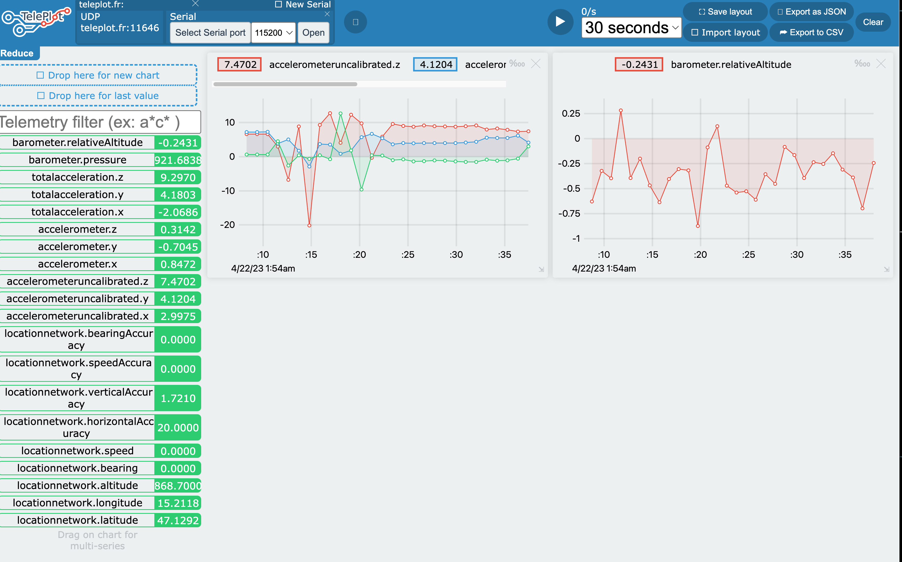

# teleplot relay for [sensorlogger](https://www.tszheichoi.com/sensorlogger)

## step 1: run https://teleplot.fr/
this will give you a UDP socket like `teleplot.fr:4711`

## step 2: run the this like so:

````
$ TELEPLOT=teleplot.fr:4711 flask run --host=0.0.0.0 --port=8000 --debug
 * Debug mode: on
WARNING: This is a development server. Do not use it in a production deployment. Use a production WSGI server instead.
 * Running on all addresses (0.0.0.0)
 * Running on http://127.0.0.1:8000
 * Running on http://172.16.0.104:8000
Press CTRL+C to quit
 * Restarting with stat
 * Debugger is active!
 * Debugger PIN: 207-525-597
172.16.0.111 - - [22/Apr/2023 02:00:13] "POST /data HTTP/1.1" 200 -
172.16.0.111 - - [22/Apr/2023 02:00:13] "POST /data HTTP/1.1" 200 -
````

## step 3: run sensorlogger with http push

- configure URI as: `http://172.16.0.104:8000/data` 
- hit `Tap to Test Pushing`
- sensorlogger should display `Got status: 200`
- hit `start recording``

https://teleplot.fr should start displaying values - drag values from left column onto canvas for plotting:




